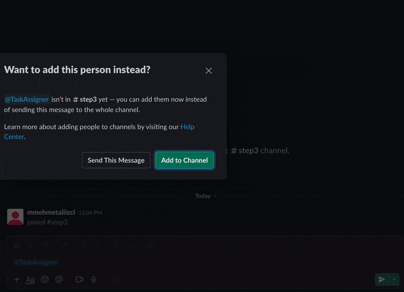
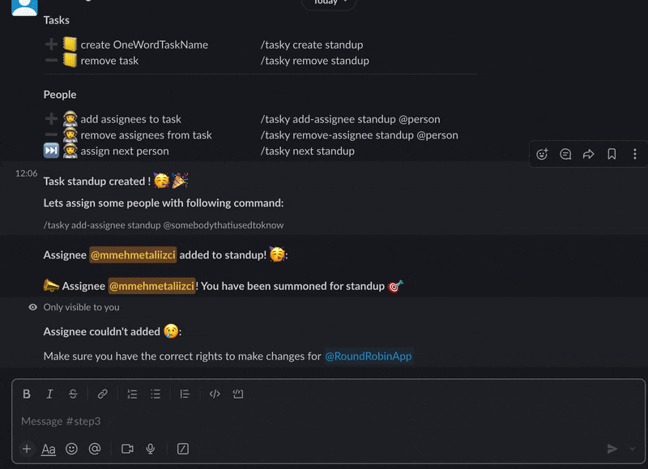

# Slack Task Assigner Repository

This repository provides a guided pathway to developing a Slack bot for task assignments. It is structured in steps:

1. **Step 1**: Initial connection with Slack.
2. **Step 2**: Implementing Slack slash commands.
3. **Step 3**: Backend connection to MongoDB and Slack bot integration.

You can either follow each step individually to understand the building blocks or skip directly to Step 3 for the final, integrated solution.

## TL:DR;




---

## If You Want to Skip to Step 3

If you decide to skip the tutorial and go directly to end result, we need to set up and connect to MongoDB, and create our slack bot.

### Running the Backend and Exposing It

1. Create a free MongoDB cluster and obtain the connection URL.
2. Navigate to `/be` and copy `env.template` to create an `env` file. Fill it out with your MongoDB credentials.
3. Run `yarn` and `yarn start` to start the backend.
4. In another terminal, run the following to expose your backend server:
   ```
   ssh -o ServerAliveInterval=60 -R be-kumbaya-my-lord-kumbaya:80:localhost:8080 serveo.net
   ```

### Setting Up the Slack Bot

1. Create a new Slack bot and choose the 'From Manifest' option.
2. Replace the "url" field in the JSON configuration with your own URL. The URL structure is crucial for the functioning of the bot:
   ```
{
    "display_information": {
        "name": "TaskAssigner"
    },
    "features": {
        "bot_user": {
            "display_name": "TaskAssigner",
            "always_online": false
        },
        "slash_commands": [
            {
                "command": "/tasky",
                "url": "https://kumbaya-my-lord-kumbaya.serveo.net/slack/events",
                "description": "help for all commands :)",
                "usage_hint": "help",
                "should_escape": true
            }
        ]
    },
    "oauth_config": {
        "scopes": {
            "bot": [
                "app_mentions:read",
                "channels:read",
                "chat:write",
                "channels:history",
                "commands"
            ]
        }
    },
    "settings": {
        "event_subscriptions": {
            "request_url": "https://kumbaya-my-lord-kumbaya.serveo.net/slack/events",
            "bot_events": [
                "message.channels"
            ]
        },
        "org_deploy_enabled": false,
        "socket_mode_enabled": false,
        "token_rotation_enabled": false
    }
}
```
3. Note down the `SLACK_SIGNING_SECRET` from the "Basic Information" section.
4. Install the bot to your workspace and get the `SLACK_BOT_TOKEN`.

### Running the Plugin

1. Navigate to `/plugin`.
2. Create an `env` file from the provided `env.template`.
3. Run `yarn` and `yarn start:dev`.
4. In another terminal, forward your localhost to HTTPS with:
   ```
   ssh -o ServerAliveInterval=60 -R kumbaya-my-lord-kumbaya:80:localhost:3000 serveo.net
   ```

### Final Steps: Invite Bot and Interact

Create a Slack channel and invite the bot by mentioning it. You now have a functioning Slack bot connected to a backend, capable of full CRUD operations.

