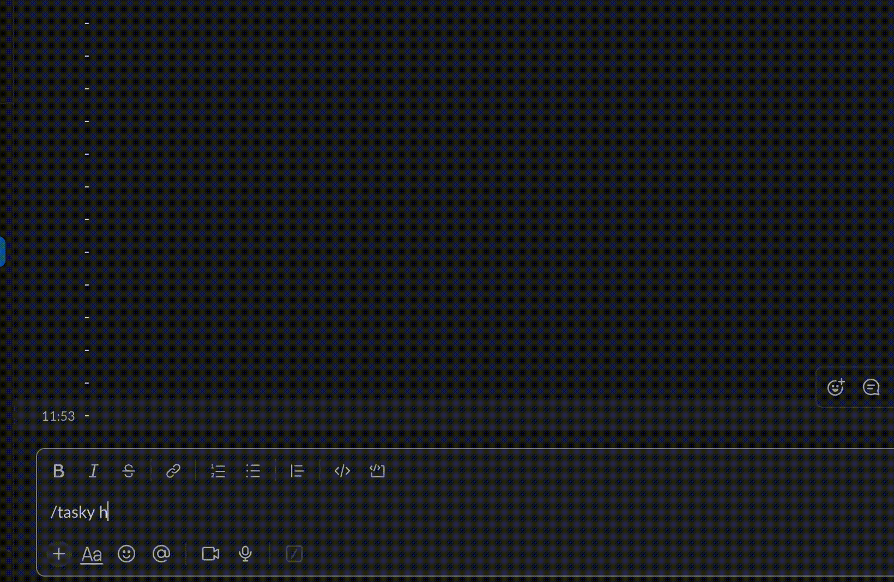

# Step 3: Slash Commands

## Overview
In this stage, we set up a slash command and configure block responses for it.

## How to Run
1. Get the necessary credentials for your Slack bot.
2. Install the packages by running: `yarn install`
3. To start the development server, run: `yarn start:dev`

Again, execute the SSH command in another terminal to set up port forwarding:
```
ssh -o ServerAliveInterval=60 -R kumbaya-my-lord-kumbaya:80:localhost:3000 serveo.net
```

## End Result
